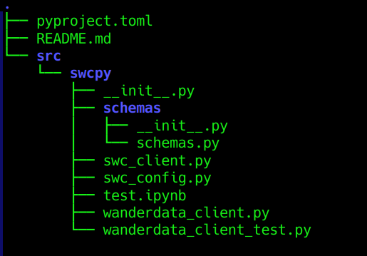

# swcpy - WanderData API Python SDK

This is the python SDK to to interact with the WanderData Travel Intelligence API, which has followed the book [Hands-On APIs for AI and Data Science](https://handsonapibook.com).

## Installing swcpy

To install this SDK in your environment, execute the following command:


`pip install swcpy@git+https://github.com/tu-usuario/wanderdata-api#subdirectory=sdk`

## Example Usage

This SDK implements all the endpoints in the SWC API, in addition to providing bulk downloads of the SWC wanderdata api in CSV format.

### Setting base URL for the API
The SDK looks for a value of `SWC_API_BASE_URL` in the environment. The preferred method for setting the base URL for the SWC API is by creating a Python `.env` file in your project directory with the following value:

```
SWC_API_BASE_URL={URL of your API}
```

You may also set this value as an environment variable in the environment you are using the SDK, or pass it as a parameter to the `SWCConfig()` method.


### Example of normal API functions

To call the SDK functions for normal API endpoints, here is an example:

```python
from swcpy import SWCClient, SWCConfig

config = SWCConfig(swc_base_url="http://localhost:8000")
client = SWCClient(config)

# Obtener booking items
bookings = client.list_booking_items()
print(bookings)
```

### Example of bulk data functions

The build data endpoint return a bytes object. Here is an example of saving a file locally from a bulk file endpoint:

```python
import csv
import os
from io import StringIO

config = SWCConfig()
    client = SWCClient(config)    

    """Tests bulk player download through SDK"""
    flight_prices_file = client.get_bulk_flight_prices_file()

    # Write the file to disk to verify file download
    output_file_path = data_dir + 'flight_prices.csv'
    with open(output_file_path, 'wb') as f:
        f.write(flight_prices_file)
```

